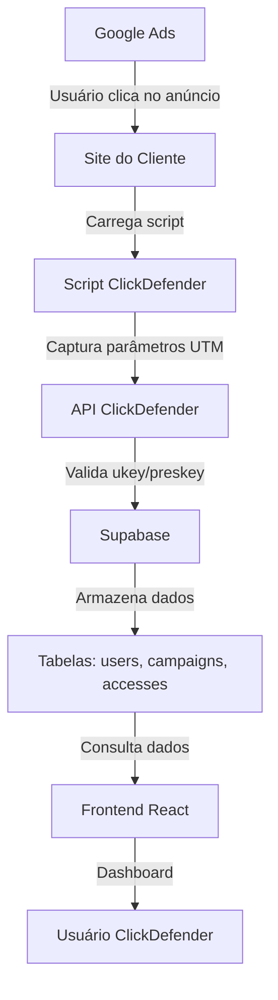
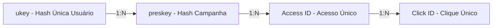
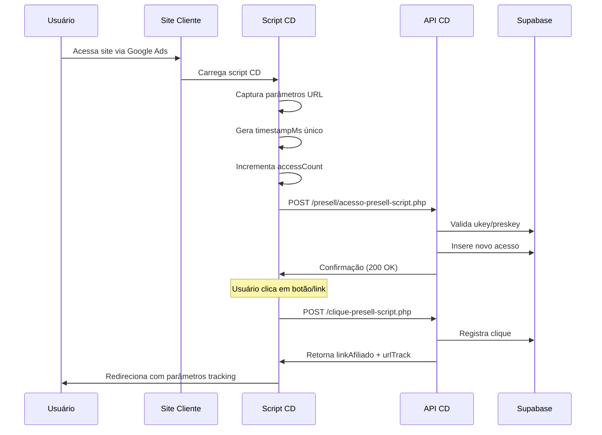
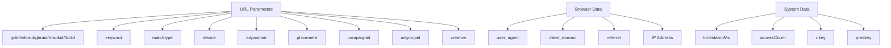
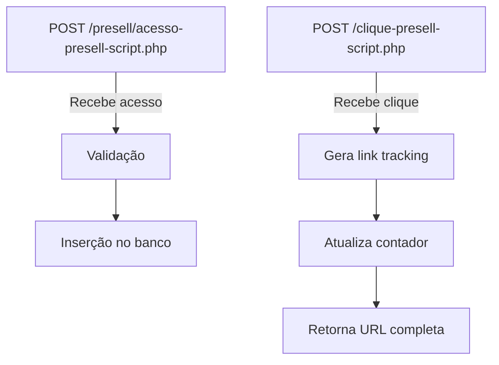
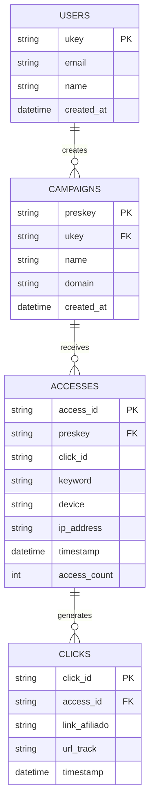
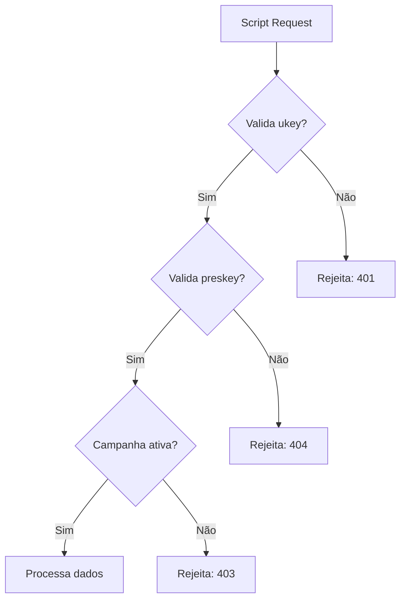

# ClickDefender - Documentação Técnica e Flowchart

## 1. Visão Geral do Sistema

O ClickDefender é um SAAS de tracking e análise de campanhas de anúncios que captura dados de visitantes através de scripts embedados em sites de clientes.

## 2. Arquitetura do Sistema

### 2.1 Fluxo Completo de Dados



### 2.2 Estrutura de IDs e Relacionamentos



## 3. Detalhamento do Fluxo de Tracking

### 3.1 Script de Tracking - Fluxo Detalhado



### 3.2 Dados Capturados por Acesso



## 4. Backend API - Endpoints e Estrutura

### 4.1 Endpoints Principais



### 4.2 Estrutura de Requisições

#### Acesso Presell
```http
POST /presell/acesso-presell-script.php
Content-Type: application/x-www-form-urlencoded

ukey=4y0I1S8p9p9x8b
preskey=9N1y3r8Z0X9R1H8C
click_id=gclid_123
keyword=marketing digital
matchtype=exact
device=mobile
adposition=1t1
placement=google.com
campaign_id=123456
adgroup_id=789012
creative_id=345678
user_agent=Mozilla/5.0...
client_domain=https://cliente.com
referrer=https://google.com
timestampMs=1699123456789
totalAcessos=15
```

#### Clique Presell
```http
POST /clique-presell-script.php
Content-Type: application/x-www-form-urlencoded

ukey=4y0I1S8p9p9x8b
preskey=9N1y3r8Z0X9R1H8C
timestampMs=1699123456789
click_id=gclid_123
totalAcessos=15
```

## 5. Estrutura do Banco de Dados

### 5.1 Diagrama ER



### 5.2 Tabelas Detalhadas

#### Tabela users
```sql
CREATE TABLE users (
    ukey VARCHAR(50) PRIMARY KEY,
    email VARCHAR(255) UNIQUE NOT NULL,
    name VARCHAR(100) NOT NULL,
    password_hash VARCHAR(255),
    plan VARCHAR(20) DEFAULT 'free',
    created_at TIMESTAMP DEFAULT NOW(),
    updated_at TIMESTAMP DEFAULT NOW()
);
```

#### Tabela campaigns
```sql
CREATE TABLE campaigns (
    preskey VARCHAR(50) PRIMARY KEY,
    ukey VARCHAR(50) REFERENCES users(ukey),
    name VARCHAR(200) NOT NULL,
    domain VARCHAR(255),
    script_url VARCHAR(500),
    status VARCHAR(20) DEFAULT 'active',
    created_at TIMESTAMP DEFAULT NOW()
);
```

#### Tabela accesses
```sql
CREATE TABLE accesses (
    access_id UUID PRIMARY KEY DEFAULT gen_random_uuid(),
    preskey VARCHAR(50) REFERENCES campaigns(preskey),
    click_id VARCHAR(255),
    keyword VARCHAR(255),
    matchtype VARCHAR(50),
    device VARCHAR(50),
    adposition VARCHAR(50),
    placement VARCHAR(255),
    campaign_id VARCHAR(100),
    adgroup_id VARCHAR(100),
    creative_id VARCHAR(100),
    user_agent TEXT,
    client_domain VARCHAR(500),
    referrer VARCHAR(500),
    ip_address INET,
    timestamp_ms BIGINT,
    access_count INTEGER,
    created_at TIMESTAMP DEFAULT NOW()
);
```

#### Tabela clicks
```sql
CREATE TABLE clicks (
    click_id UUID PRIMARY KEY DEFAULT gen_random_uuid(),
    access_id UUID REFERENCES accesses(access_id),
    link_afiliado VARCHAR(1000),
    url_track VARCHAR(500),
    timestamp_ms BIGINT,
    created_at TIMESTAMP DEFAULT NOW()
);
```

## 6. Frontend - Dashboard e Visualização

### 6.1 Fluxo de Dados no Frontend

```mermaid
graph TD
    A[Login] -->|ukey| B[Dashboard Principal]
    B -->|Seleciona campanha| C[Campaign Detail]
    C -->|Filtra por data| D[Access List]
    D -->|Clique em acesso| E[Click Details]
    
    F[API Calls] -->|GET /api/campaigns| G[List campaigns]
    F -->|GET /api/accesses/{preskey}| H[List accesses]
    F -->|GET /api/clicks/{access_id}| I[List clicks]
```

### 6.2 Páginas Principais

1. **Dashboard.tsx** - Visão geral das campanhas
2. **Campanhas.tsx** - Lista detalhada de campanhas
3. **Criar.tsx** - Criar nova campanha
4. **Plataformas.tsx** - Configuração de plataformas

## 7. Segurança e Validações

### 7.1 Validações de Script



### 7.2 Rate Limiting

- Máximo 100 requests por minuto por preskey
- Bloqueio automático após 10 tentativas inválidas
- Logs de auditoria para todos os requests

## 8. Performance e Escalabilidade

### 8.1 Índices Recomendados

```sql
-- Performance queries
CREATE INDEX idx_accesses_preskey_timestamp ON accesses(preskey, created_at DESC);
CREATE INDEX idx_accesses_click_id ON accesses(click_id);
CREATE INDEX idx_clicks_access_id ON clicks(access_id);
CREATE INDEX idx_campaigns_ukey ON campaigns(ukey);
```

### 8.2 Cache Strategy

- Redis para dados de dashboard (TTL: 5 min)
- Cache de campanhas ativas (TTL: 1 hora)
- CDN para scripts de tracking

## 9. Monitoramento e Logs

### 9.1 Métricas Importantes

- Taxa de sucesso de tracking (>99%)
- Tempo de resposta da API (<200ms)
- Quantidade de acessos por campanha
- Taxa de cliques (CTR)

### 9.2 Alertas

- Queda na taxa de tracking
- Spike anormal de acessos
- Erros 5xx na API
- Scripts bloqueados (CORS/adblock)